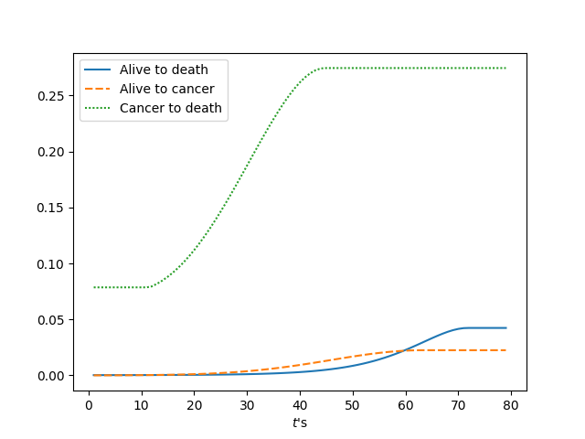
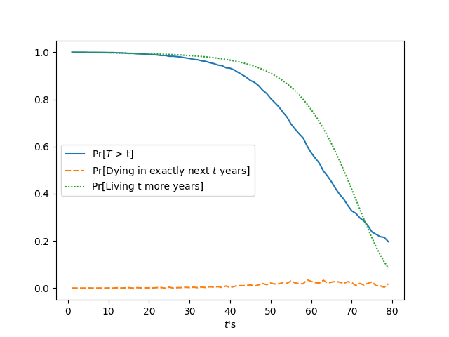

<!-- _class: lead -->

# Using Non-homogenous Markov Chains to calculate when we (are expected) to die

##### By a dying CS student (Nawat)

---

<!-- _header: Disclaimer -->

## Disclaimer!

The results shown here are not rigorous! This may disappoint some people but I am perfectly fine with it (~~and you will be, too~~).

## Disclaimer! Part 2

Nawat is in fact not dying and the person presenting is definitely not one of his evil clones.

---

<!-- _header: Introduction -->

## Non-homogenous Markov Chain

A non-homogenous Markov Chain is a Markov Chain whose transition probability **depends** on time. However, it still ignores *the past*.

---

<!-- _header: Introduction -->

## Non-homogenous Markov Chain (NHMC)

A non-homogenous Markov Chain is a Markov Chain whose transition probability **depends** on time. However, it still ignores *the past*.

That is,
$$
\Pr[X_{t+1} = j | X_0 = i_0, X_1 = i_1, \dots, X_t = i] = \Pr[X_{t+1} = j | X_t = i]
$$
but
$$
\Pr[X_{t+1} = j | X_t = i] \neq \Pr[X_1 = j | X_0 = i] \ \text{for}\ t \neq 0
$$

---

<!-- _header: Introduction -->

## Modeling a Stochastic Process with NHMC

Similar to Homogenous Markov Chains, we define the transition probability from state $i$ to state $j$ as a function of time
$$
p_{i, j}(t+1) = \Pr[X_{t+1} = j | X_t = i]
$$
then store them in a sequence of transition matrix $\{P(t)\}_{t=0}^\infty$
$$
P(t) = \left[p_{i, j}(t)\right]_{i, j \in S}
$$
where $S$ is the state space.

---

<!-- _class: lead -->

# The Live-Death Model

---

<!-- _header: The Live-Death Model -->

## Assumptions

- You are now 20 years old (i.e. $x=20$)
- You are an average human being in terms of physical health
- Cancer and other diseases don't exist (yet)

---

<!-- _header: The Live-Death Model -->

### Ultimate Survival Model (USM)

$$
\mu_x = A + Bc^x
$$
where $A = 0.00022, B = 2.7\times10^{-6}, c = 1.124$.

Let $T$ be the lifespan of a person. We denote

$$
\begin{align*}
{}_t p_x &= \Pr[T > x+t | T > x] \\
         &= e^{-\int_{s=0}^t \mu_{x+s} \, ds}
\end{align*}
$$
where $x$ is the starting age and $t$ is the number of years left.

---

<!-- _header: The Live-Death Model -->

### Using USM with NHMC

Let $S = \{A \text{(Alive)}, D \text{(Dead)}\}$. Obviously, $D$ is a recurrent state. We want to find the transition probability $A \to D$. Denote

$$
\begin{align*}
{}_k q_x &= \Pr[x+k \leq T \leq x+k+1 | T > x] \\
         &= {}_k p_x - {}_{k+1} p_x
\end{align*}
$$

Lastly, define the sequence of transition matrices $\{P_x(t)\}_{t=0}^\infty$
$$
P_x(t) = \begin{bmatrix}
    1 - {}_t q_x & {}_t q_x \\
    0 & 1
\end{bmatrix}
$$

---

<!-- _header: The Live-Death Model -->

## Expected Time Left to Live

$$
\begin{align*}
    \text{E}[T] &= \sum_{t=0}^\infty t \cdot p_{A, D}(t) \\
                &= \sum_{t=0}^\infty t \cdot {}_t q_x \\
                &\approx 66.413
\end{align*}
$$
(i.e. you are expected to die at around age 86.)

---

<!-- _header: The Live-Death Model -->

---

<!-- _header: The Live-Death Model -->

## Using First-step Analysis

Let $\mu_{A, D}(t)$ be the expected hitting time at year $t$. We get
$$
\begin{align*}
    \mu_{A, D}(t)
        &= 1 + (1 - p_{A, D}(t)) \cdot \mu_{D, D} + p_{A, D}(t) \cdot \mu_{A, D}(t+1) \\
        &= 1 + {}_t q_x\cdot\mu_{A, D}(t+1)
\end{align*}
$$
and we have infinitely many of these.

---

<!-- _class: lead -->

# Thank you!

##### Credit to `kaisugi` on Github for the theme

---

<!-- _class: lead -->

# The (More) General Model

---

<!-- _header: The (More) General Model -->

## The New Model

Let $S = \{A, C, D\}$ where $C$ is for cancer. The sequence of transition matrix can be defined by
$$
P = \begin{bmatrix}
    1 - {}_t q_x - c_t & c_t & {}_t q_x \\
    0 & 1 - d_t & d_t \\
    0 & 0 & 1
\end{bmatrix}
$$
where $c_t$ is the probability of being diagnosed with cancer at year $t$ and $d_t$ is the probability of dying from cancer at year $t$.

---

<!-- _header: The (More) General Model -->

#### Rate of Getting Cancer

Fitted with $f(x) = a e^{-\frac{(x-b)^2}{c}}$

---

<!-- _header: The (More) General Model -->

#### Mortality Rate of Cancer

Fitted with $f(x) = ax^4 + bx^3 + cx^2 + dx + k$

---

<!-- _header: The (More) General Model -->

### All the Probabilities Together

---

<!-- _header: The (More) General Model -->

## Probability of dying or living for longer than another $t$ years

---

<!-- _header: The (More) General Model -->

## Expected Time Left to Live

Using the same strategy as before based on the previous graph, we have that
$$
\text{E}[T] \approx 66
$$
(It's more like around 66-70 depending on the run.)

---

<!-- _class: lead -->

# Thank you!

##### Credit to `kaisugi` on Github for the theme
